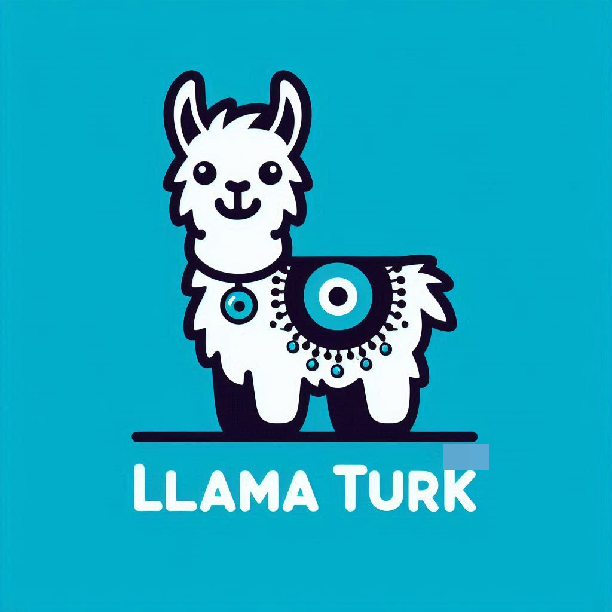

<p align="center"></p>
<p align="center"></p>

# LlamaTurk: Adapting Open-Source Generative Large Language Models for Low-Resource Language

[Paper](https://arxiv.org/abs/2405.07745)

[Published Models (to run PEFT models, see inference code below)](https://huggingface.co/metunlp)

[Instruction set used in instruction fine-tuning](data/llamaturk_instruction_set.json)

[Instruction set used in instruction fine-tuning (at HuggingFace)](https://huggingface.co/datasets/metunlp/LlamaTurk-Instruction-Set)

[Dataset used in tasks-specific fine-tuning](https://huggingface.co/datasets/maydogan/TRSAv1)

[Evaluation benchmark dataset: Belebele](https://huggingface.co/datasets/facebook/belebele/viewer/default/tur_Latn)

[Evaluation benchmark dataset: XCOPA](https://huggingface.co/datasets/xcopa/viewer/tr)

[Tokenizer used in vocabulary extension](bpe_28k_oscar_tr_tokenizer.json)

[Source code for instruction fine-tuning](src/finetune_instruction.py)

[Source code for task-specific fine-tuning](src/finetune_task.py)

[Source code for continual training](src/continual_train.py)

[Source code for vocabulary extension](src/vocabulary_extension.py)

[Source code for instrinsic evaluation (perplexity calculation)](src/perplexity.py)

[Source code for extrinsic evaluation (task inference)](src/inference_task.py)

[Source code for getting model checkpoints for an adapted model](src/merge_base_and_finetuned_models.py)

Citation:
```
@inproceedings{toraman-2024-adapting,
    title = "Adapting Open-Source Generative Large Language Models for Low-Resource Languages: A Case Study for {T}urkish",
    author = "Toraman, Cagri",
    editor = {S{\"a}lev{\"a}, Jonne  and
      Owodunni, Abraham},
    booktitle = "Proceedings of the Fourth Workshop on Multilingual Representation Learning (MRL 2024)",
    month = nov,
    year = "2024",
    address = "Miami, Florida, USA",
    publisher = "Association for Computational Linguistics",
    url = "https://aclanthology.org/2024.mrl-1.3",
    doi = "10.18653/v1/2024.mrl-1.3",
    pages = "30--44",
    abstract = "Despite advancements in English-dominant generative large language models, further development is needed for low-resource languages to enhance global accessibility. The primary methods for representing these languages are monolingual and multilingual pretraining. Monolingual pretraining is expensive due to hardware requirements, and multilingual models often have uneven performance across languages. This study explores an alternative solution by adapting large language models, primarily trained on English, to low-resource languages. We assess various strategies, including continual training, instruction fine-tuning, task-specific fine-tuning, and vocabulary extension. The results show that continual training improves language comprehension, as reflected in perplexity scores, and task-specific tuning generally enhances performance of downstream tasks. However, extending the vocabulary shows no substantial benefits. Additionally, while larger models improve task performance with few-shot tuning, multilingual models perform worse than their monolingual counterparts when adapted.",
}
```
